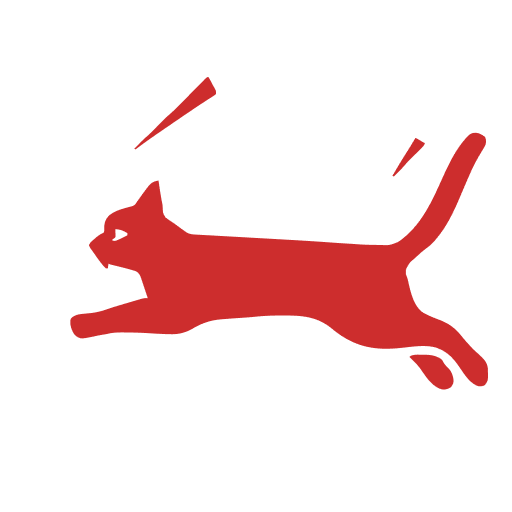
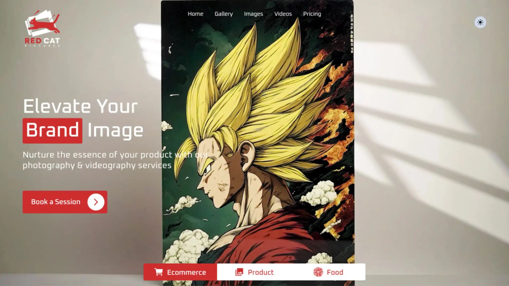

<p align="center">
  
<p>

# RED CAT PICTURES

> Nurture the essence of your product with our photography & videography services in kolkata

<p align="center">
  <a href="https://redcatpictures.betteruptime.com">
    
  </a>
</p>



https://g.page/r/CaroFd9d81EjEBM/review

- [] Update photos and videos url slug
- [] Modify content page to show gallery view
- [] Whatsapp Automation

- [] Facebook Automation
- [] Update task sync:meta-data for optimistic cached update
- [] Image Search
- [] Update Photo page with title and description
- [] Instagram Automation
- [] Share Url
- [] Modify Photo page to Project page
- [] Videos and Video page
- [] Modify About Us page
- [] Like/Dislike Count Content
- [] Add live streaming page
- [] Audio Dictation of Content

## How to Deploy

1. Initialize Swarm on the Manager Node

```bash
docker swarm init --advertise-addr <MANAGER-IP>
```

2. Join Worker Nodes to the Swarm

```bash
docker swarm join --token <WORKER-TOKEN> <MANAGER-IP>:2377
```

3. Check Node Status

```bash
docker node ls
```

4. Create a docker volume

```bash
docker volume create \
  --name red-cat-pictures_static \
  --driver local \
  --opt type=none \
  --opt device=~/Algostract/red-cat-pictures/static \
  --opt o=bind
```

5. Use Docker Stack to deploy multi-container application

```bash
export $(cat .env.prod) && docker stack deploy --compose-file docker-compose.prod.yml red-cat-pictures
```

6. Scale the service

```bash
docker service scale red-cat-pictures_app=5
```

7. Check

```bash
docker service ls
docker service ps red-cat-pictures_app
```
